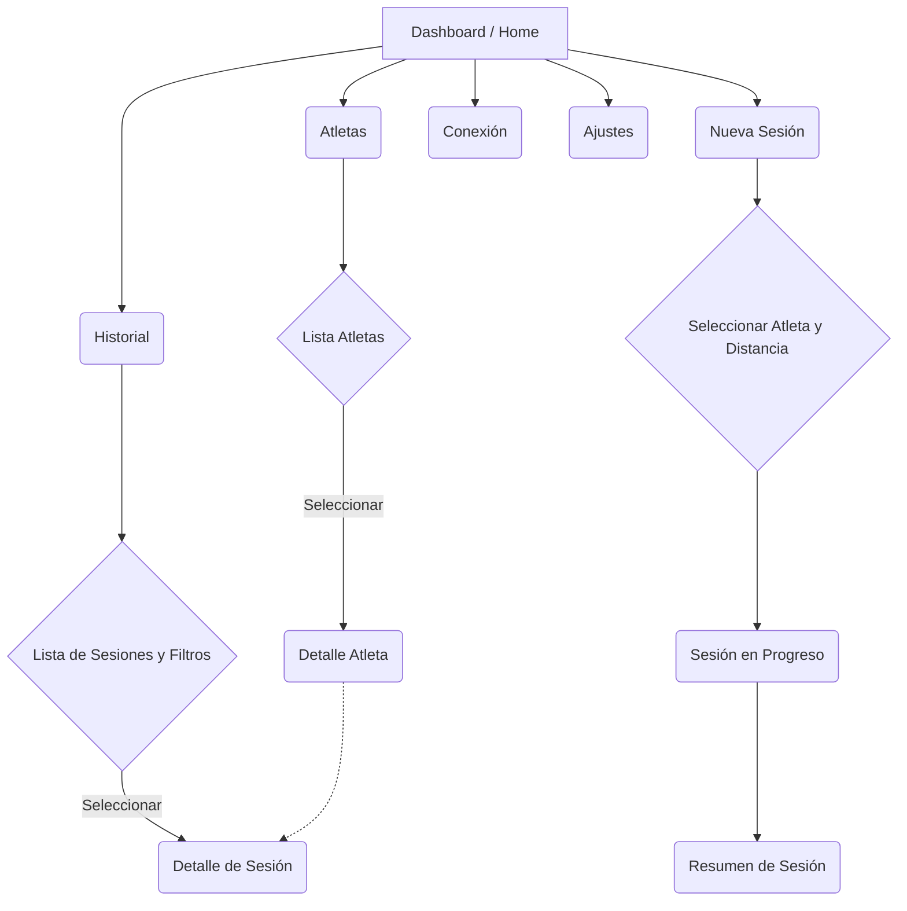

# Sprint Timer - Especificación UX/UI

Esta especificación detalla el mapa de navegación, las pantallas, la jerarquía visual y el manejo de estados de la aplicación "Sprint Timer".

## 1. Mapa de Navegación (User Flow)

## 2. Descripción de Pantallas

### A) Home / Dashboard
- **Objetivo**: Proveer un resumen rápido y acceso directo a las acciones principales.
- **Componentes**:
  - Encabezado: "Hola, Entrenador" + Resumen del día.
  - Quick Actions (Tarjetas de navegación): "Nueva sesión" (Destacado), "Atletas", "Historial".
  - Tarjetas pequeñas: "Estado de Conexión" y "Ajustes".
  - Lista inferior: "Últimas sesiones" (Top 3).

### B) Atletas
- **B1. Lista de Atletas**:
  - Búsqueda (Search bar) por ID o Nombre.
  - `AthleteTile`: Avatar, ID, Nombre, y "última sesión".
- **B2. Detalle de Atleta**:
  - Cabecera con Avatar, ID y Nombre.
  - Tarjetas de resumen: "Mejor tiempo 50m", "Mejor tiempo 100m".
  - Gráfica simple: Evolución del ECV o Tiempo en las últimas 5 sesiones.
  - Botón: "Ver historial completo".

### C) Nueva sesión (Registro)
- **C1. Configuración**:
  - Dropdown o chips para seleccionar Atleta (por ID).
  - Chips grandes para la Distancia (50m / 100m).
  - Estado del sistema (Cerebro: Conectado, Peón Salida: OK...).
- **C2. En Progreso**:
  - UI limpia, enfocada en la recepción de eventos.
  - Estados secuenciales: "Esperando en salida", "¡En carrera!", "Llegada", "Recuperación (HR)".
  - Botón "Simular (Mock)" si no hay sensores.
- **C3. Finalizado**:
  - Navega automáticamente al *Detalle de Sesión*.

### D) Historial
- **Filtros (FilterBar)**: Scrollable horizontal con chips (Atleta, Distancia, Rango de fechas).
- **Lista de sesiones**: `SessionTile` con información condensada (Fecha, Distancia, Tiempo, ECV).

### E) Detalle de sesión
- **Resumen principal**: Tarjetas de métricas (MetricCard) para Tiempo, Velocidad (m/s o km/h), Promedio HR (Run/Rec), y **ECV** (Eficiencia Cardiovascular).
- **Indicador de Tendencia**: Una flecha (verde arriba / roja abajo) comparada con la sesión anterior del mismo atleta en esa distancia.
- **Sección de Gráficas**: 
  - Gráfica de línea mostrando la evolución de la Frecuencia Cardíaca en el tiempo.
  - Dividida en dos regiones (Sombreado oscuro para 'Run', sombreado claro para 'Recovery').

### F) Conexión / Estado del Sistema
- **Panel de dispositivos**: 
  - "Cerebro" (Cronómetro principal)
  - "Peón de Salida"
  - "Peón de Llegada"
  - "Banda HR"
- **Estados**: Chip dinámico (Verde: Conectado, Rojo: Desconectado).
- **Métricas técnicas**: Último timestamp (Heartbeat) y calidad de señal (RSSI o %).

### G) Ajustes
- **Preferencias**: 
  - Unidades (km/h vs m/s).
  - Fórmula ECV.
  - Distancia por defecto.
- **Gestión de datos**: 
  - "Exportar datos a CSV".
  - "Borrar base de datos local".

## 3. Manejo de Estados

### 3.1. Estados Vacíos (Empty States)
- **Dashboard "Últimas sesiones"**: "Aún no hay sesiones registradas. Comienza una nueva sesión."
- **Historial**: "No se encontraron sesiones para los filtros seleccionados."
- **Atletas**: "No hay atletas en la base de datos."

### 3.2. Estados de Error
- **Pérdida de conexión en sesión**: Banner superior no intrusivo rojo "Conexión perdida con Peón de Llegada".
- **Error guardando datos**: Snackbar "Error al guardar la sesión localmente".
- **Datos insuficientes (HR)**: En detalle de sesión, si no hubo HR, mostrar la tarjeta en gris con texto "No se recibieron datos HR. ECV no disponible."
